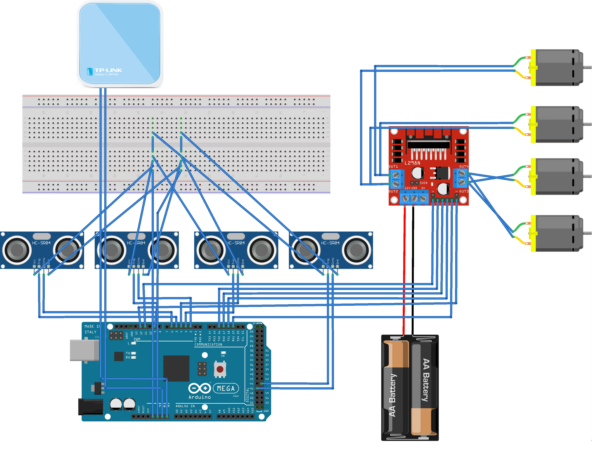

# Arduino Car PlatformIO Project

This project is a PlatformIO-based project for an Arduino car. It provides the necessary code and configuration to control the Arduino-based car using PlatformIO.

## Getting Started

To get started with the Arduino car project, follow the steps below:

### Prerequisites

- PlatformIO: Make sure you have the PlatformIO installed on your computer. You can download it from the [PlatformIO website](https://platformio.org/).

### Configuration

1. Connect the Arduino board to your computer using a USB cable.

2. Open the platformio.ini file in the project folder.

3. Modify the board parameter in the platformio.ini file to match your Arduino board model. Refer to the [PlatformIO documentation](https://docs.platformio.org/en/latest/) for the list of supported boards.

4. Save the platformio.ini file.

### Uploading the Code

1. Open the [main code file](src/main.cpp) in your text editor or IDE.

2. Modify the code as needed for your Arduino car project.

3. Save the changes.

4. Build and upload the code to your Arduino board by executing the following command in the project folder:

```bash
pio run --target upload
```

## Usage

The Arduino car can be operated using the [main.py](scripts/main.py) script. The script provides the following functions:
1. Drawing a map of the car's path.
2. Capturing Images from the Car's Camera, Performing Object Detection, and Saving the Detected Image Results.
3. Controlling the Car to Return.

Note: [Virtual port mapping](images/virtual-port.png) is required to use the above features.

## Folder Structure

The main folder structure of the project is as follows:

```bash Stores project documentation
├── src/               # Stores source code
│   └── main.cpp         # Main main code file
├── scripts/           # Scripts Required for Car Operation
│   └── main.py          # Main application file    
├── platformio.ini     # Project configuration file
└── extra_script.py    # Project's flashing script file
```

## Circuit Diagram

The Fritzing simulation circuit diagram of the car is as follows:



## Authors

